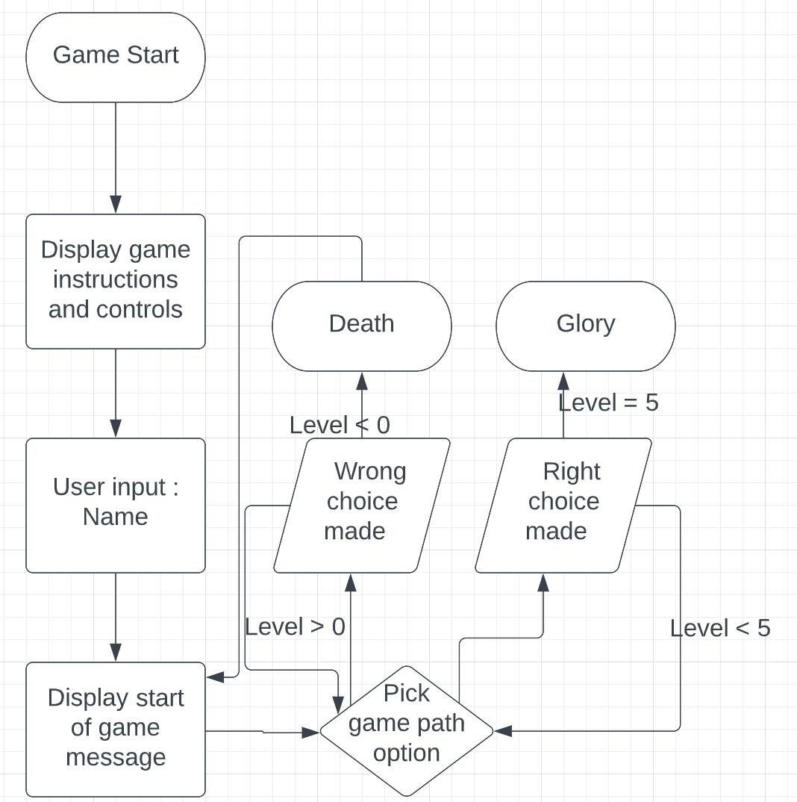

# Go North - A Text-Based Adventure Game

* [Play deployed game here](https://go-north.herokuapp.com/)

## Concept
Users will follow onscreen prompts to select an option to progress to the next stage of their adventure. The correct option will promote them along through the game, the wrong choice could lead them backwards, or worse. 

Overview of gameplay


## User Stories

Users should be able to
* Understand what to enter at each prompt.
* Recieve clear feedback for incorrect text entries.
* Find out how to play the game.

## Gameplay Logic
```
Call main()
    Display title screen( print to screen )
    Input username - verifyname( check input contains alpha chars only )
    Print Options 1 - Start 2 - How to play
                        Display instructions( print to screen then display input options again )
    start game()
        Build new Game object
        Display Game string representation
        Print initial game option
        User input response - verify response ( check for a, b, c, d then run Handle response() )
        Handle response ( Check response type advance - display next set of options and increment game level counter / hold - re display same set of responses calls display opt())
        While game level counter < 5
            User input response - verify response()
            Handle response()
    End game( Display end of game message and option to re start or quit )
```
## Project Development

### verify_username() function:

This function gives the user a keyboard input and saves to the username variable. This is checked for alphabetic only characters using `isalpha()`. If this returns true, the user is welcomed to the game and the function returns the username to the main function to contiue running. If this returns false, an error message is displayed to prompt the user to enter only alpha characters and to try again. 

### verify_first_choice() function:

This function gives the user the first options within the game, to start the game or display the gameplay instructions. Logic is included to check which option is returned from the user, and an else catches "other" responses to display an error and prompt the user to enter a valid response either 1 or 2 in this case.

### display_current_option() function:

This function takes in the Game object from where it is called and uses the Pathway object, and the game level of the current game to determine which set of options to display to the user. 
The game path is a set of lists within the Pathway object, by using the current game level as an index for the list of lists, this function then gives the user the correct set of on screen options.

### verify_response() function:

This function asks for a choice from the available game path choices displayed by the `display_current_option()` function and then checks that the user response is valid. If the response is invalid, an error message is displayed on screen with a prompt of the 4 correct options to choose from and cycles back to the start of the input and checking sequence again. Once a valid option has been verified, this is returned back to the main game flow and stored to be used by other functions to continue game play.

### handle_response() function:

This function calls on the `verify_response()` function to gain the users next validated pathway choice. It then extracts the game's storyline response from the Pathway object's options dictionary and displays the next part of the story to the user. Using an if statement, the function then gets the `True` or `False` indicator attached to the choice made by the user to decide if `True` the game levels up and continues along the game path or if `False` .....


### build_story() function

This function is called when building the Pathway object and contains a randomly generated storyline each game. It uses 3 text files to combine positive, negative and winning scenarios to make a replayable story. For each level, the positives are shuffled and 2 options are added to the level container followed by 2 options from a shuffled negatives list. This level list is shuffled, and then appended to the overall story dictionary. The final level is constructed from 2 choices from a shuffled winning choices list and 2 choices from the remaining negatives list before being shuffled and appended to the storyline dictionary. The full story dictionary is returned by the function as the options attribute of the Pathway object.

## Testing

[Link to testing carried out](TESTING.md)


## Future Features

Given more time and scope to develop this project, I would have liked to allow users to select the difficuly of the game allowing for shorter / longer game lengths. I would have also liked to work on developing the storyline to give better flow of responses and options, and build in a choice of pathways to take for further replayability. 

## Deployment

The site was deployed to Heroku. The steps to deploy are as follows: 
  - Fork or Clone the [GitHub repository](https://github.com/ccp84/go_north) 
  - Create a new [Heroku](https://id.heroku.com/login) app
  - In the app settings, add Python and NodeJS buildpacks (maintain that order)
  - In app settings, add a config var of KEY: PORT, VALUE: 800
  - In deploy, link your GitHub repo
  - Enable deployment

The live link can be found [here](https://go-north.herokuapp.com/)

## Technologies Used
* Git - Version control and project flow management
* [GitHub Issues - For tracking and resolving bug fixes](https://github.com/ccp84/go_north/issues)
* Code Institute Python Terminal Template
* [Heroku - Deployment of Python project](https://id.heroku.com/login)
* Python Class and Object Oriented Code

## Credits

* [Flowchart from Lucidchart](https://lucid.app/)
* [Isalpha for checking username from w3schools](https://www.w3schools.com/python/ref_string_isalpha.asp#:~:text=The%20isalpha()%20method%20returns,alphabet%20letters%3A%20(space)!)
* [Storyline and creative ideas based on John Robertsons live interactive show](https://www.thejohnrobertson.com/thedarkroom/)
* [Block letters formation from Codecademy](https://www.codecademy.com/courses/learn-python-3/projects/python-block-letters)
* [File handling method from Codecademy tutorial](https://www.codecademy.com/courses/learn-python-3/lessons/learn-python-files/)
* [How to shuffle from w3schools documentation](https://www.w3schools.com/python/ref_random_shuffle.asp)
* [String replace method learned in Codecademy tutorial](https://www.codecademy.com/courses/learn-python-3/lessons/string-methods/)
* [Fix for using ast / json to remove added aspostrophes when appending to a dictionary from StackOverflow](https://stackoverflow.com/questions/53052277/add-string-to-dictionary-without-quotes-in-python)