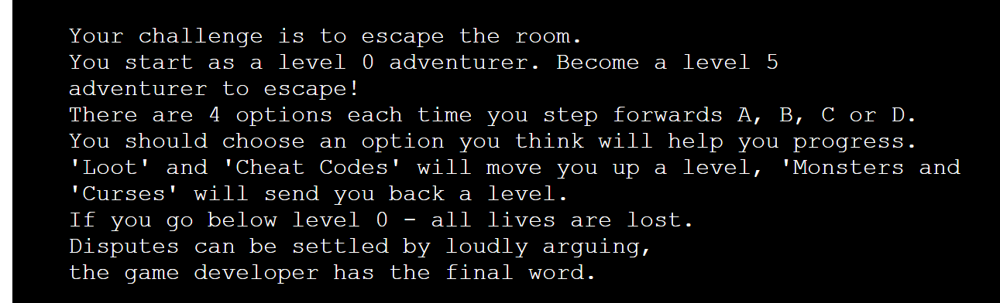

# Go North - A Text-Based Adventure Game


* [Play deployed game here](https://go-north.herokuapp.com/)

## Concept
Go North is aimed at Munckin and D&D players who are fans of [John Robertsons live action text based adventure The Dark Room](https://www.thejohnrobertson.com/thedarkroom/).
Users begin as a level 0 adventurer. By selecting from on screen options as they go through the game, they can gain or loose levels on their quest to become a level 5 adventurer! 
'Loot' and 'Cheat Codes will gain levels. 'Monsters' or 'Curses' will loose levels.
Loose too many levels and it's game over.

Overview of gameplay


## User Stories

Users should be able to
* Understand what to enter at each prompt.
* Recieve clear feedback for incorrect text entries.
* Find out how to play the game.
* Exit back to the start point at any time. 


## Gameplay Logic
```
Call main()
    Display title screen( print to screen )
    Input username - verifyname( check input contains alpha chars only )
    Print Options 1 - Start 2 - How to play
                        Display instructions( print to screen then display input options again )
    start game()
        Build new Game object
        Display Game string representation
        Print initial game option
        User input response - verify response ( check for a, b, c, d, x then run Handle response() )
        Handle response: 
            (Check response type:
            x = exit back to game menu
            a,b,c,d = enter while loop
            other = display error and ask for re entry of response
        While game level counter < 5
            User input response - verify response()
            Handle response()
        If game level counter < 0
            Game over
            Return to start of game
        If game level counter > 5
            Display winning message
            Return to start of game
    End game
```
## Project Development

### display_title_screen() function:

This function uses a multi line string to print the title art to the screen at the start of the game, and then displays a welcome message introducing the game. 


### clear_terminal() function:

The code for this function was researched from [Stack Overflow](https://stackoverflow.com/questions/2084508/clear-terminal-in-python) and when called, clears all previous text from the mock terminal placing the most recent output at the top of a clean window. This keeps the game flow fresh and easy to read for the user. 

### verify_username() function:

This function gives the user a keyboard input and saves to the `username` variable. A check variable is initialised to `True` while checking is taking place inside a while loop. 

The test is run to see if the input stored to the `username` variable consists of all alpha characters, using `isalpha`. If this test proves `True`a print statement welcomes the user to the game. At this point the check variable is also set to `False` to indicate that checking is no longer taking place and the while loop can be broken. The loop ends and the verified variable `username` is returned by the function.


`else` an error message is shown to the user that the input they have given is invalid and they should enter only letters for their name.


### verify_first_choice() function:

This function gives the user the first options within the game, to start the game or display the gameplay instructions. 

An `if elif` statement handles input of 1 - calls `start_game()` 


or 2 - calls `display_instructions()`



An `else` then handles any incorrect entries and loops the user back, displaying the choices again


### display_instructions() function:

This function first makes use of the `clear_terminal()` function to clear the screen. It prints out the game instructions using a multi line string, and then calls `verify_first_choice()` to loop the user back to their start of game choices once again.


### start_game() function:

The `start_game()` function is responsible for the main running of the game. It firstly uses the `clear_terminal()` function to clear the game window ensuring the new game starts at the top of the screen. It then builds a new game using the `Game` class storing this as the object `new_game`. Within this object the journey the user is taken on is stored in an object built from the `Pathway` class. 

A `while` loop is initialised, checking against `new_game.game_level` which will hold the user in the current game. During this time they are guided through the pathway with `display_option()` showing them each set of 4 options to choose from, and `handle_response()` either increasing or decreasing their `game_level` based on the option chosen.

When `game_level > 5` and the user becomes a Level 5 Adventurer the `while` loop is broken, a congratulatory message is displayed and the user is returned to the start menu by calling `verify_first_choice()`.


### display_option() function:

This function takes in the `current_game` object as an argument and uses the `gamepath` attribute of that object to determine the set of options that should be displayed for the users current level.
The `gamepath` is an object of the `Pathway` class which builds itself from `story.py`.

`display_level` is set to `game_level + 1` to account for the initial level starting at 0 and the timing of calculations meaning an index of -1 being passed to the options list just before 'death'. The `display_level` is used as an index to retrieve the list of options linked to the current level of play from `gamepath`. 


### verify_response() function:

This function asks for a choice from the available game path choices displayed by the `display_current_option()` function and then checks that the user response is valid. 

It first sets a check variable to `False` to indicate that verification is not yet complete and holds a `while` loop whilst waiting for checking to be completed. Input from the user is converted using `lower()` so that both 'A' and 'a' etc. are accepted as responses and verified as acceptable by the `if` statement. 

If the user input is checked as acceptable, the checking variable is set to `True` and the `while` loop is broken. The verified input is returned from the function to the game to be used to continue gameplay. 

However if the user input does not pass the initial `if` statement an `else` statement displays an error message and the user is held in the `while` loop to try again.


### handle_response() function:

This function calls on the `verify_response()` function to gain the users next validated pathway choice. It then extracts the game's storyline response from the Pathway object's options dictionary and displays the next part of the story to the user. Using an if statement, the function then gets the `True` or `False` indicator attached to the choice made by the user to decide if `True` the game levels up and continues along the game path or if `False` .....


### build_story() function

This function is called when building the Pathway object and contains a randomly generated storyline each game. It uses 3 text files to combine positive, negative and winning scenarios to make a replayable story. For each level, the positives are shuffled and 2 options are added to the level container followed by 2 options from a shuffled negatives list. This level list is shuffled, and then appended to the overall story dictionary. The final level is constructed from 2 choices from a shuffled winning choices list and 2 choices from the remaining negatives list before being shuffled and appended to the storyline dictionary. The full story dictionary is returned by the function as the options attribute of the Pathway object.

## Testing

[Link to testing carried out](TESTING.md)


## Future Features

Given more time and scope to develop this project, I would have liked to allow users to select the difficuly of the game allowing for shorter / longer game lengths. I would have also liked to work on developing the storyline to give better flow of responses and options, and build in a choice of pathways to take for further replayability. 

## Deployment
​
Code Institute has provided a [template](https://github.com/Code-Institute-Org/python-essentials-template) to display the terminal view of this backend application in a modern web browser. This is to improve the accessibility of the project to others.
​
The live deployed application can be found at [Go North](https://go-north.herokuapp.com/).
​
### Local Deployment
​
*Gitpod* IDE was used to write the code for this project.
​
To make a local copy of this repository, you can clone the project by typing the follow into your IDE terminal:
- `git clone https://github.com/ccp84/go_north.git`
​
Alternatively, if using Gitpod, you can click below to create your own workspace using this repository.
​
[](https://gitpod.io/#https://github.com/ccp84/go_north)
​
### Heroku Deployment
​
This project uses [Heroku](https://www.heroku.com), a platform as a service (PaaS) that enables developers to build, run, and operate applications entirely in the cloud.
​
Deployment steps are as follows, after account setup:
​
- Select *New* in the top-right corner of your Heroku Dashboard, and select *Create new app* from the dropdown menu.
- Your app name must be unique, and then choose a region closest to you (EU or USA), and finally, select *Create App*.
- From the new app *Settings*, click *Reveal Config Vars*, and set the value of KEY to `PORT`, and the value to `8000` then select *add*.
- Further down, to support dependencies, select *Add Buildpack*.
- The order of the buildpacks is important, select `Python` first, then `Node.js` second. (if they are not in this order, you can drag them to rearrange them)
​
Heroku needs two additional files in order to deploy properly.
- requirements.txt
- Procfile
​
You can install this project's requirements (where applicable) using: `pip3 install -r requirements.txt`. If you have your own packages that have been installed, then the requirements file needs updated using: `pip3 freeze --local > requirements.txt`
​
The Procfile can be created with the following command: `echo web: node index.js > Procfile`
​
For Heroku deployment, follow these steps to connect your GitHub repository to the newly created app:
​
- In the Terminal/CLI, connect to Heroku using this command: `heroku login -i`
- Set the remote for Heroku: `heroku git:remote -a <app_name>` (replace app_name with your app, without the angle-brackets)
- After performing the standard Git `add`, `commit`, and `push` to GitHub, you can now type: `git push heroku main`
​
The frontend terminal should now be connected and deployed to Heroku.

## Technologies Used
* Git - Version control and project flow management
* [GitHub Issues - For tracking and resolving bug fixes](https://github.com/ccp84/go_north/issues)

* Code Institute Python Terminal Template
* [Heroku - Deployment of Python project](https://id.heroku.com/login)
* Python Class and Object Oriented Code

## Credits

* [Flowchart from Lucidchart](https://lucid.app/)
* [Isalpha for checking username from w3schools](https://www.w3schools.com/python/ref_string_isalpha.asp#:~:text=The%20isalpha()%20method%20returns,alphabet%20letters%3A%20(space)!)
* [Storyline and creative ideas based on John Robertsons live interactive show](https://www.thejohnrobertson.com/thedarkroom/)
* [Further storyline ideas from Steve Jackson's Munchkin](http://www.sjgames.com/)
* [Block letters formation from Codecademy](https://www.codecademy.com/courses/learn-python-3/projects/python-block-letters)
* [File handling method from Codecademy tutorial](https://www.codecademy.com/courses/learn-python-3/lessons/learn-python-files/)
* [How to shuffle from w3schools documentation](https://www.w3schools.com/python/ref_random_shuffle.asp)
* [String replace method learned in Codecademy tutorial](https://www.codecademy.com/courses/learn-python-3/lessons/string-methods/)
* [Fix for using ast / json to remove added aspostrophes when appending to a dictionary from StackOverflow](https://stackoverflow.com/questions/53052277/add-string-to-dictionary-without-quotes-in-python)
* [Clear terminal function from stack overflow](https://stackoverflow.com/questions/2084508/clear-terminal-in-python)
* Mentor, Tim Nelson, for assistance with Heroku deployment instructions.