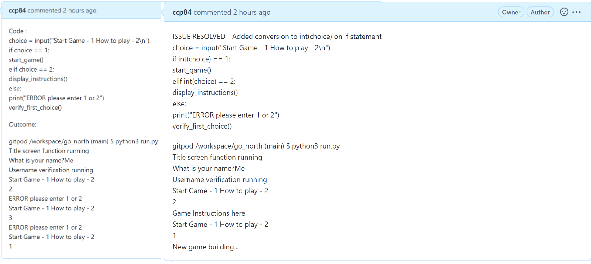
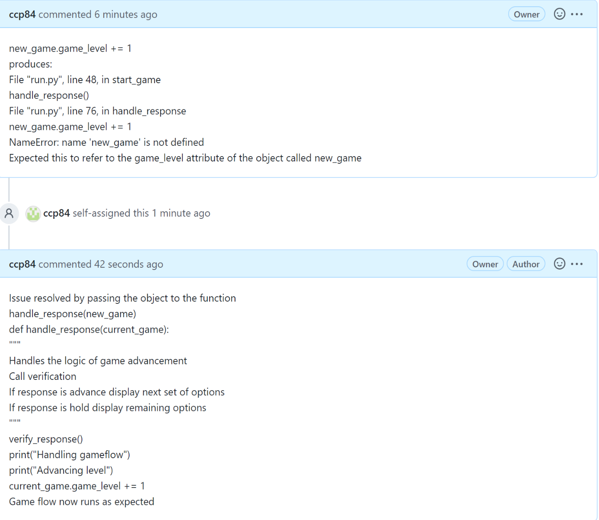
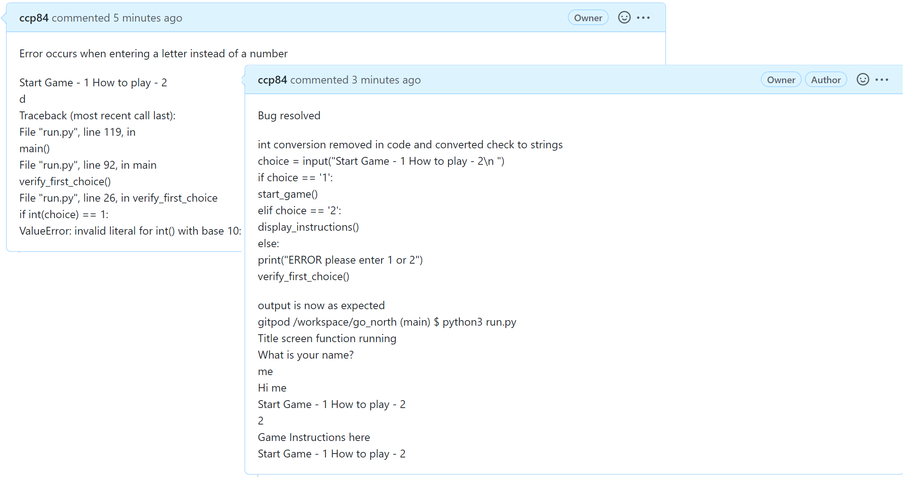
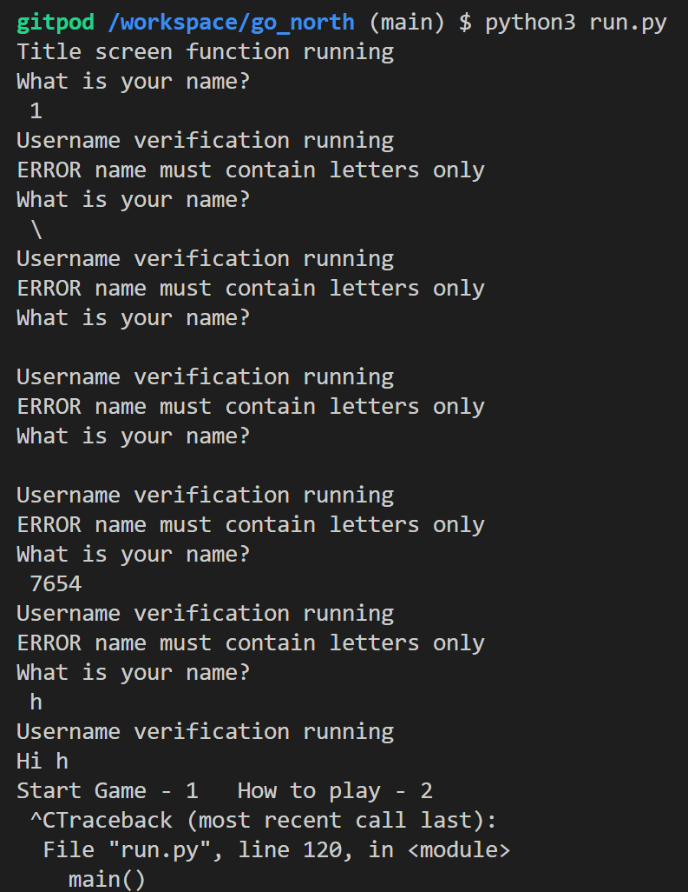
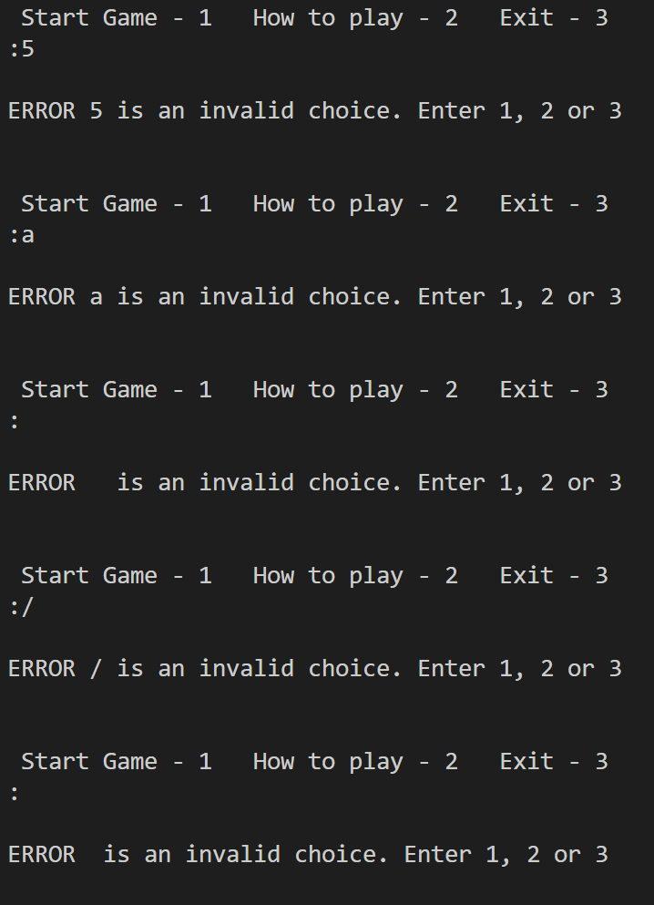

# Testing

## Bug Fixes

* [verify_first_choice() if statement](https://github.com/ccp84/go_north/issues/1)

* [handle_response() game_level variable](https://github.com/ccp84/go_north/issues/2)

* [verify_first_choice() enter a letter](https://github.com/ccp84/go_north/issues/3)

## Manual Testing

* Username input - an if statement checks that only alpha characters are entered and displays an error message if this check returns false. Tests proved to only accept alpha characters as below.

* Choosing between 'Start Game' and 'How to Play' - an input box takes the users choice for which action to perform and then checks the response. An if/elif/else statement handles the response. If an invalid option is entered, an error message is displayed and the user is prompted to try again. 
