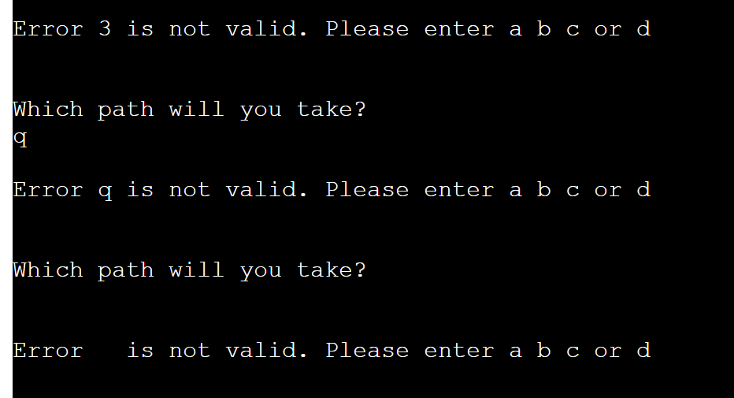
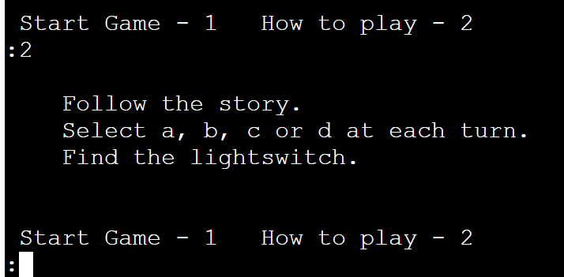
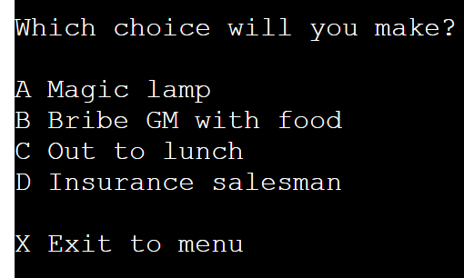
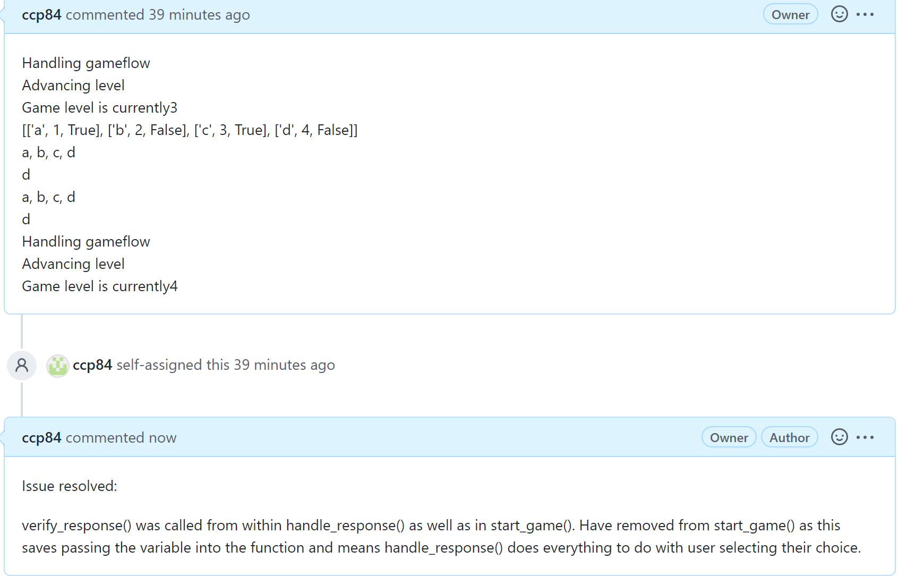
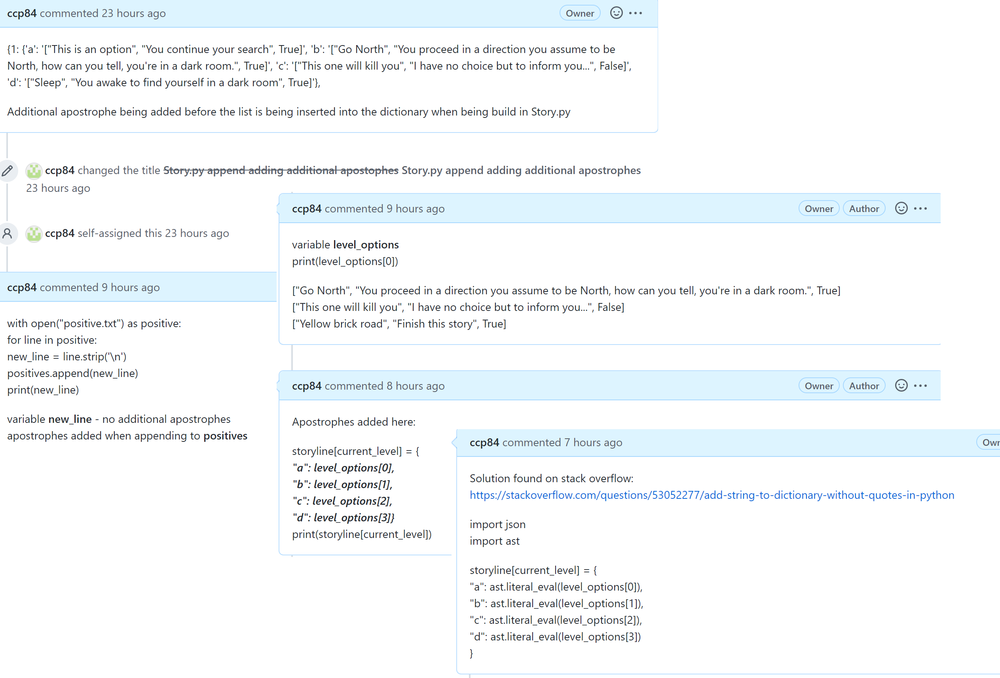
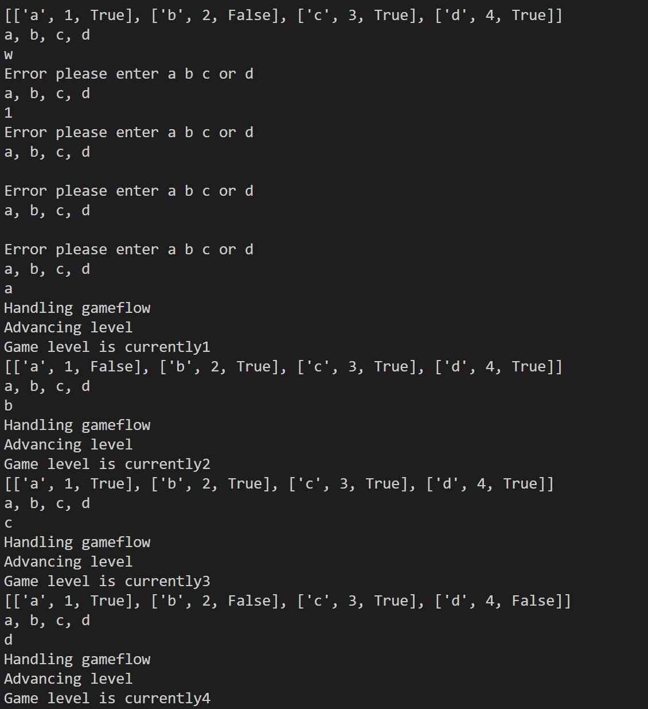
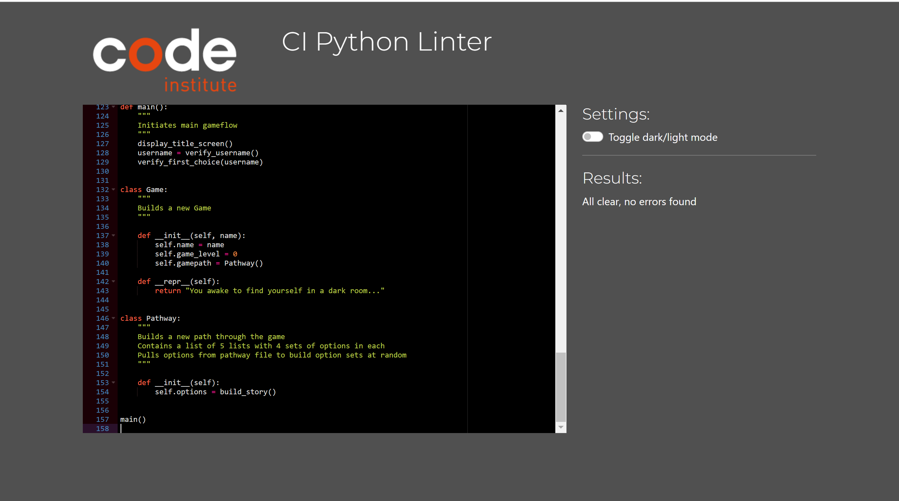
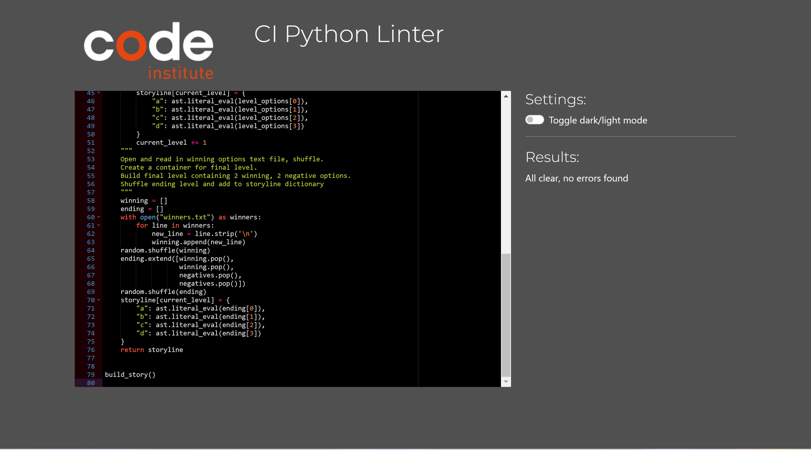

# Testing

## User Stories

| Test  | Outcome | Proof |
|----|--------|--------|
|Understand what to enter at each prompt.| Every time the user is asked to enter text, the acceptable enteries are explained to them. | |
|Recieve clear feedback for incorrect text entries.|Invalid entries are highlighted as incorrect with the correct choices repeated and the user prompted to select again.||
|Find out how to play the game.| The user can select to display the rules at the start of each game.||
Exit back to the start point at any time. | The user is given the option to quit the game during each selection point of the game. | 

## Bug Fixes

* [verify_first_choice() if statement](https://github.com/ccp84/go_north/issues/1)

* [handle_response() game_level variable](https://github.com/ccp84/go_north/issues/2)

* [verify_first_choice() enter a letter](https://github.com/ccp84/go_north/issues/3)

* [display_option() runs twice in game play flow](https://github.com/ccp84/go_north/issues/4)

* [Issue appending to dictionary adding apostrophes](https://github.com/ccp84/go_north/issues/5)

## Bugs Remaining

* Tests carried out revealed no remaining bugs.

## Manual Testing

* Username input - an if statement checks that only alpha characters are entered and displays an error message if this check returns false. Tests proved to only accept alpha characters as below.

* Choosing between 'Start Game' and 'How to Play' - an input box takes the users choice for which action to perform and then checks the response. An if/elif/else statement handles the response. If an invalid option is entered, an error message is displayed and the user is prompted to try again. 

* Choosing a b c or d as the game path option - the verify choice function checks `if` input matches a, b, c or d once converted to lowercase to account for entries of A, B, C or D. Otherwise an error message is displayed on screen and a prompt to the user to enter a valid option and another chance to input their choice again. 

## Code validation with CI validation app

Both python files pass through the Code Institute PEP8 validator with no errors:

* [Back to README](README.md)