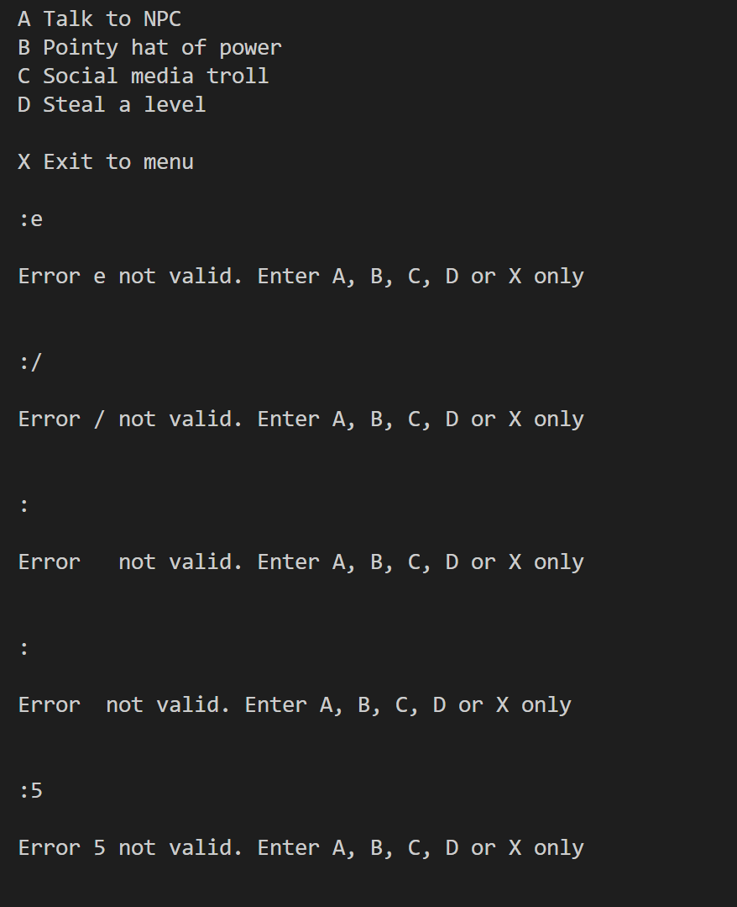

# Testing

## User Stories

| Test  | Outcome | Proof |
|----|--------|--------|
|Understand what to enter at each prompt.| Every time the user is asked to enter text, the acceptable enteries are explained to them. | |
|Recieve clear feedback for incorrect text entries.|Invalid entries are highlighted as incorrect with the correct choices repeated and the user prompted to select again.||
|Find out how to play the game.| The user can select to display the rules at the start of each game.||
Exit back to the start point at any time. | The user is given the option to quit the game during each selection point of the game. | 

## Bugs encountered and fixed during production

* [verify_first_choice() if statement](https://github.com/ccp84/go_north/issues/1)

* [handle_response() game_level variable](https://github.com/ccp84/go_north/issues/2)

* [verify_first_choice() enter a letter](https://github.com/ccp84/go_north/issues/3)

* [display_option() runs twice in game play flow](https://github.com/ccp84/go_north/issues/4)

* [Issue appending to dictionary adding apostrophes](https://github.com/ccp84/go_north/issues/5)

## Bugs Remaining

* Tests carried out revealed no remaining bugs to the best of my knowledge.

## Manual Testing

| Test | Expected Outcome | Outcome | Proof |
| ---  | -----------------| ------- | ----- |
|Username input| Only alpha characters accepted. | Tried entering : A number, a character, a space, just hitting enter - all returned an error message informing me this was an invalid entry and that the username must contain letters only. |  |
| Choosing between 'Start Game', 'How to Play' and 'Exit' | Only '1', '2' or '3' is accepted | Tried entering : 5, a letter, a space, a character, and a blank entry. These all returned an error message stating to enter 1 or 2. Entering 2 displayed a test string in place of the full game rules, entering 1 started the game flow. Confirmed that 3 returns the user to the title screen. |  |
| Choosing a b c or d as the game path option | Only A, a, B, b, C, c, D, d, X, or x should be accepted. | Tests showed that entering e, /, space, blank, or 5 returned an error message that this was an invalid entry and to select from the given options. |  |

## Code validation with CI validation app

Both python files pass through the Code Institute PEP8 validator with no errors:

* [Back to README](README.md)